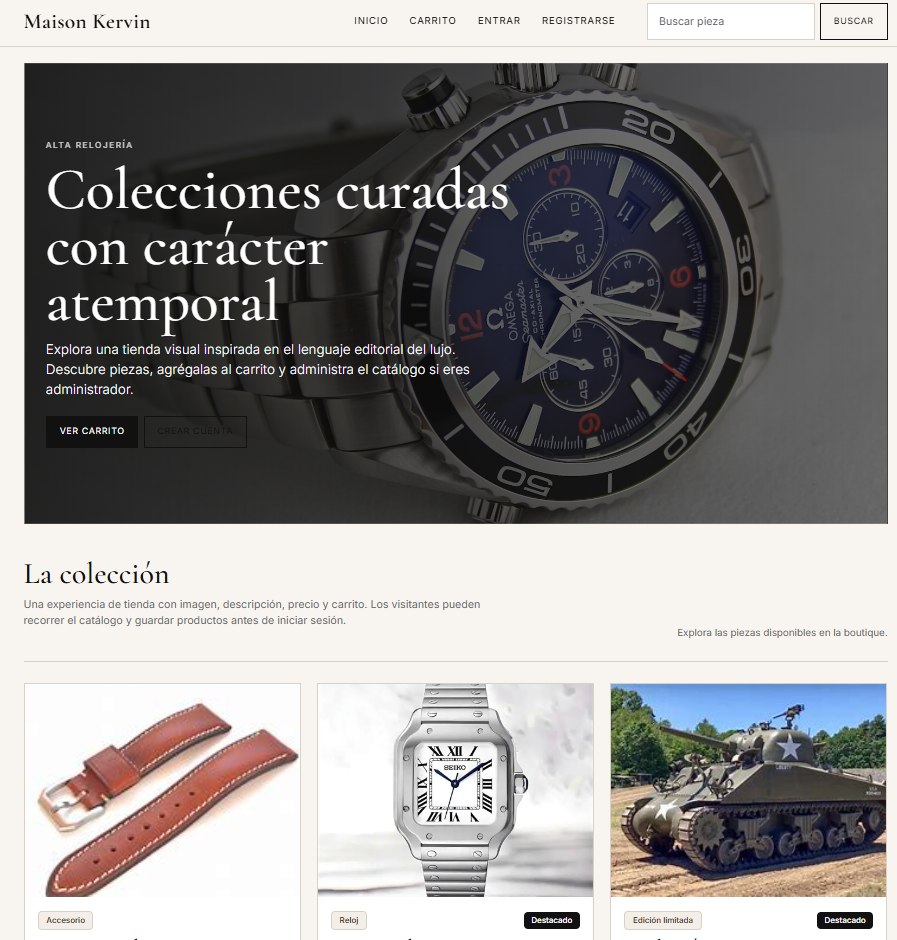
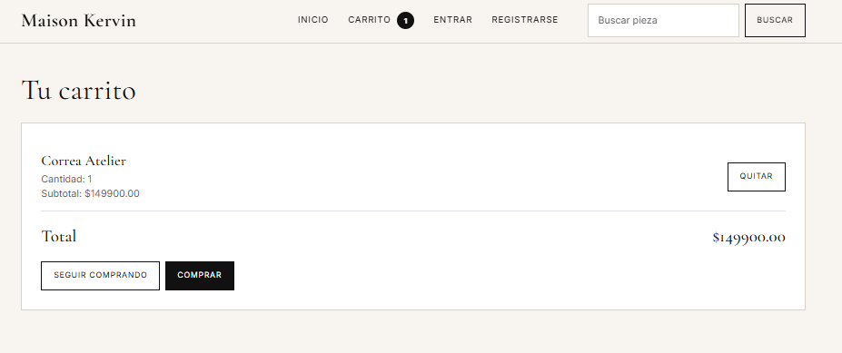
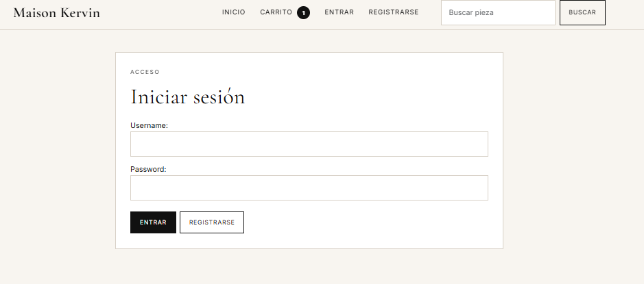
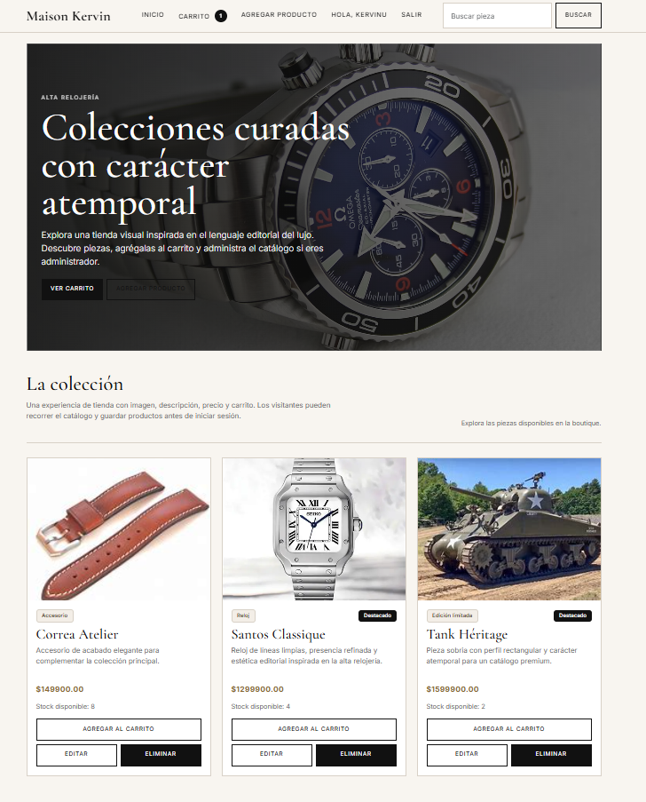

# Django Luxury Store

A role-based e-commerce web application built with Django.

This project includes a public storefront, session-based shopping cart, user authentication, and admin-only product management in a premium luxury-inspired interface.

## Overview

This application simulates a modern online store with two main user roles:

- **Guest / regular user**: can browse products, add items to the cart, register, log in, and continue to checkout.
- **Admin user**: can create, edit, and delete products.

The UI was designed with a luxury editorial direction inspired by high-end retail websites.

## Features

- Public storefront for visitors
- Product search
- Product cards with image, description, and price
- Session-based shopping cart
- User registration and login
- Checkout flow that requires authentication
- Admin-only product creation, editing, and deletion
- Media upload support for product images
- Responsive premium-style interface

## Tech Stack

- Django
- Python
- HTML
- CSS
- Bootstrap 5
- SQLite
- Pillow

## Screenshots






## Project Structure

```bash
app_mtv/
Kervinproyecto1/
screenshots/
manage.py
README.md
requirements.txt
```

## Installation

### 1. Clone the repository

```bash
git clone https://github.com/YOUR-USERNAME/YOUR-REPOSITORY.git
cd YOUR-REPOSITORY
```

### 2. Create a virtual environment

#### Windows
```bash
python -m venv .venv
.venv\Scripts\activate
```

#### macOS / Linux
```bash
python3 -m venv .venv
source .venv/bin/activate
```

### 3. Install dependencies

```bash
pip install -r requirements.txt
```

### 4. Apply migrations

```bash
python manage.py makemigrations
python manage.py migrate
```

### 5. Create a superuser

```bash
python manage.py createsuperuser
```

### 6. Run the development server

```bash
python manage.py runserver
```

Open the app at:

```bash
http://127.0.0.1:8000/app_mtv/
```

## User Roles

### Guest User
- Can browse the store
- Can add products to the cart
- Must register or log in before checkout

### Authenticated User
- Can browse the store
- Can use the cart
- Can complete checkout

### Admin
- Can add, edit, and delete products
- Can access protected product management views

## What I Built

This project was built to practice full-stack Django development with authentication, role-based access, cart logic, and a more polished storefront UI.

## What I Learned

- Django routing and views
- Template inheritance
- Authentication and permissions
- Session-based cart logic
- Media file handling
- UI structuring for portfolio projects

## Future Improvements

- Order history
- Payment integration
- Product filtering by category
- Better admin dashboard
- Automated tests
- Deployment setup

## License

This project is for educational and portfolio purposes.
